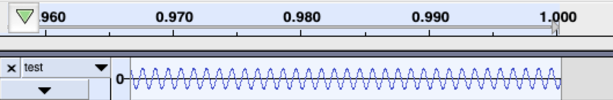
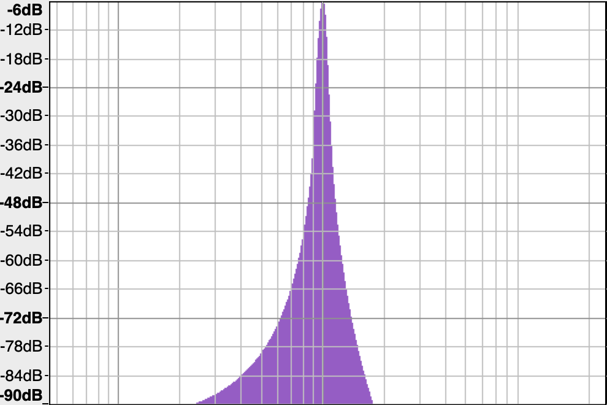
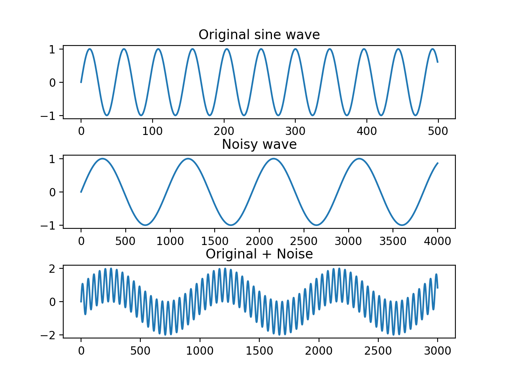
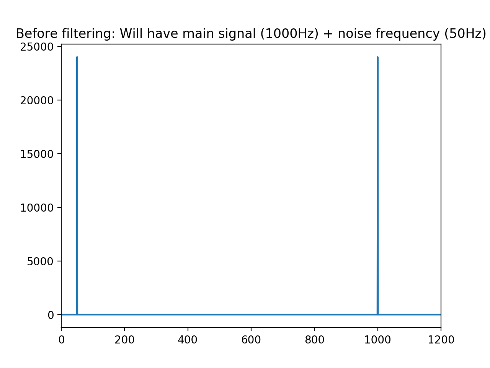
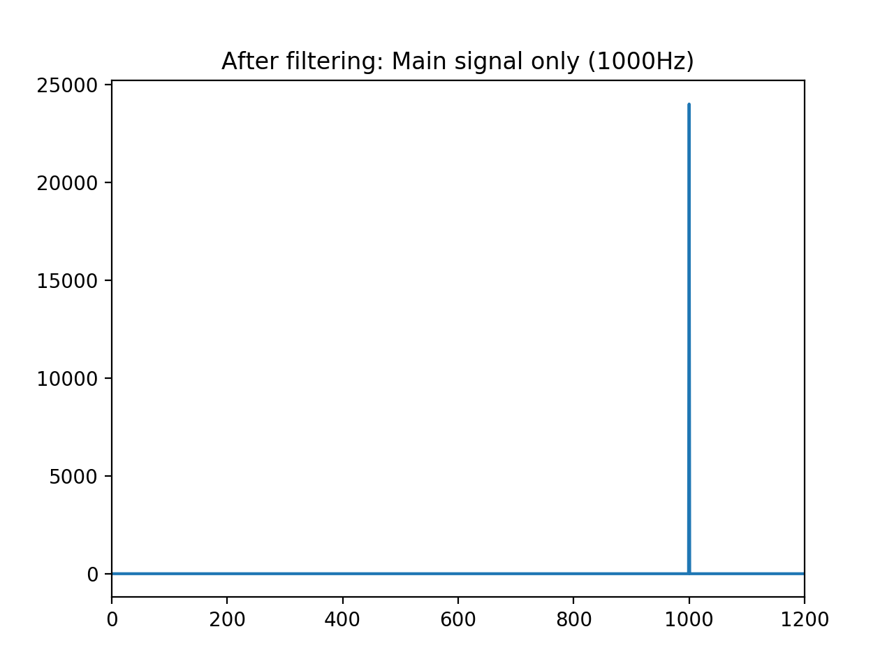
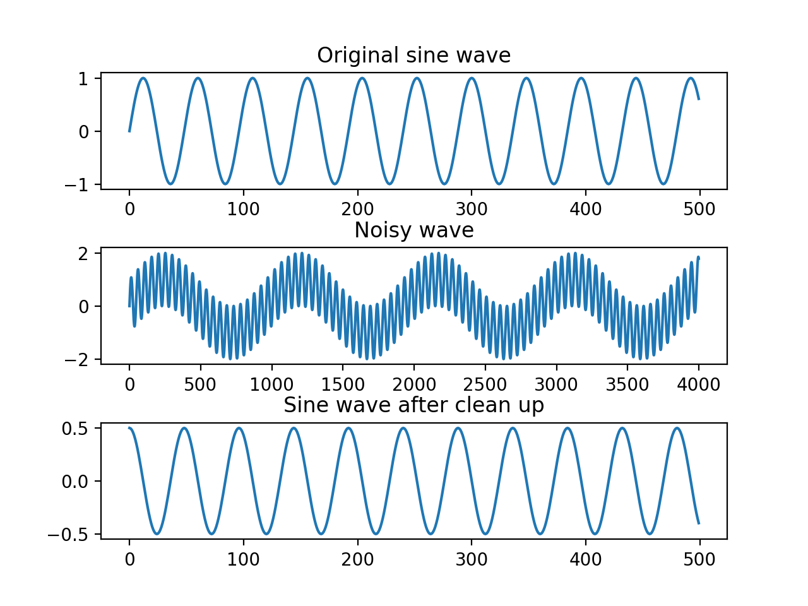

# simple-filtering-and-fourier-transform-for-raspberryPi

This repository is meant to be educational and used as a crude introduction to signal processing. 


First, we will generate a .wav file representing a 1000 Hz sine wave. Here is the code to do so.

```python
import numpy as np
import wave
import struct
import matplotlib.pyplot as plt

frequency = 1000
num_samples = 48000
noisy_freq = 50
sampling_rate = 48000.0
amplitude = 16000
file = "test.wav"
sine_wave = [np.sin(2 * np.pi * frequency * x1 / sampling_rate) for x1 in range(num_samples)]
```


Analyzing the clean wave, this is what we will have


 


Next, we will add noise to our wave. We will do this by adding the following lines to the above code.

``` python
sine_noise = [np.sin(2 * np.pi * noisy_freq * x1/  sampling_rate) for x1 in range(num_samples)]
combined_signal = sine_wave + sine_noise
```
If we plot the data thus far, this is what we wil have.



Lets take a fourier transform to take a look at the frequency domain of our noisy wave.



Next, we will apply our filter to the wave to try to clean it. We will do this with the follwing logic and plot the results.

```python
filtered_freq = [f if (950 < index < 1050 and f > 1) else 0 for index, f in enumerate(freq)]
```


Finally, we will use the inverse fourier transform formula to revert our wave back to the time domain, and plot the results.




The entire code will be as follows

```python
import numpy as np
import wave
import struct
import matplotlib.pyplot as plt

frequency = 1000
num_samples = 48000
noisy_freq = 50
sampling_rate = 48000.0
amplitude = 16000
file = "test.wav"

sine_wave = [np.sin(2 * np.pi * frequency * x1 / sampling_rate) for x1 in range(num_samples)]
sine_noise = [np.sin(2 * np.pi * noisy_freq * x1/  sampling_rate) for x1 in range(num_samples)]

sine_wave = np.array(sine_wave)
sine_noise = np.array(sine_noise)

combined_signal = sine_wave + sine_noise
plt.subplot(3,1,1)
plt.title("Original sine wave")

plt.subplots_adjust(hspace=.5)
plt.plot(sine_wave[:500])
plt.subplot(3,1,2)
plt.title("Noisy wave")
plt.plot(sine_noise[:4000])
plt.subplot(3,1,3)
plt.title("Original + Noise")
plt.plot(combined_signal[:3000])
plt.show()

data_fft = np.fft.fft(combined_signal)
freq = (np.abs(data_fft[:len(data_fft)]))

plt.plot(freq)
plt.title("Before filtering: Will have main signal (1000Hz) + noise frequency (50Hz)")
plt.xlim(0,1200)
plt.show()

filtered_freq = [f if (950 < index < 1050 and f > 1) else 0 for index, f in enumerate(freq)]
recovered_signal = np.fft.ifft(filtered_freq)

plt.plot(filtered_freq)
plt.title("After filtering: Main signal only (1000Hz)")
plt.xlim(0,1200)
plt.show()
plt.close()
plt.subplot(3,1,1)
plt.title("Original sine wave")

plt.subplots_adjust(hspace=.5)
plt.plot(sine_wave[:500])
plt.subplot(3,1,2)
plt.title("Noisy wave")
plt.plot(combined_signal[:4000])
plt.subplot(3,1,3)
plt.title("Sine wave after clean up")
plt.plot((recovered_signal[:500]))
plt.show()
```
